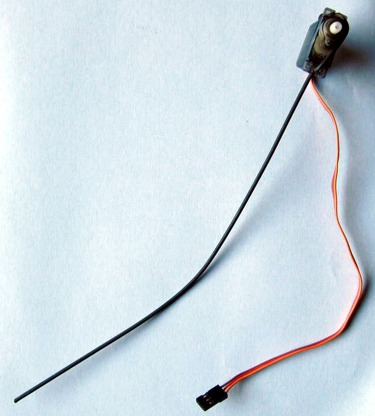
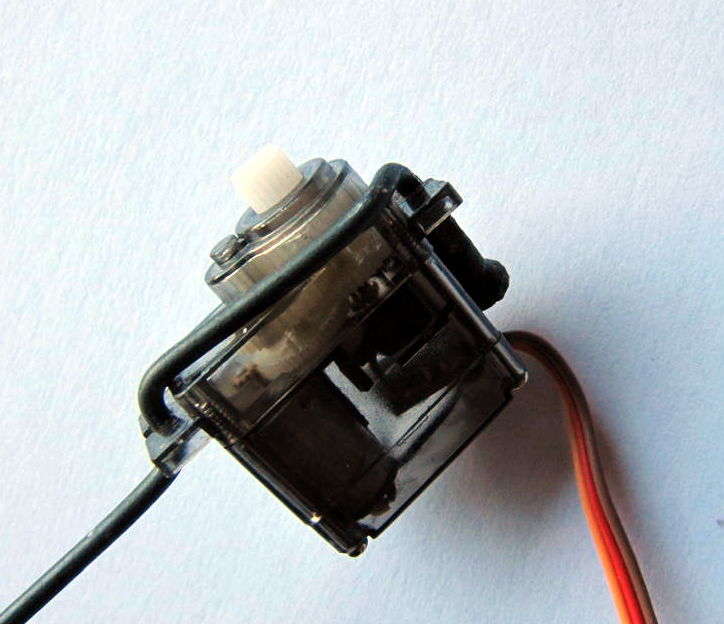

# Robots

## Stiltbot (hypothetical)

### Materials
* Two old bicycle spokes and spoke nipples
* Three HXT900-like servos, modified to give access to the potmeter value
* Small version of an Arduino or other uController
* Accelerometer
* Battery (eg 3S LiPo) and a BEC that converts battery power to 5 to 6 V, at least 1A
* Some small pieces of wood or other mounting material

### Description

While working on the Ostrichbot I noticed that the mounting holes of a HXT900-like microservo are exactly the right size for an old bicycle spoke (yeah, I'm Dutch). This solved one of my construction problems, namely how to create a slightly flexible, but still sturdy leg for a robot, and gave me the idea for a simplified Ostrichbot. Here are photos of Stiltbots compliant leg:

I bent the spoke so that it fits through the two mounting holes exactly, and the screw thread in the right position to fasten it at one of the mounting holes with the matching spoke nipple. If you want to do this yourself, use steel spokes and make sure you have the right spoke diameter (there's three standard diameters, don't know which one I used at the moment). This gives a quite nice compliant foot for robots of 100 to 500 grams (guesstimate). Of course, you can also bent the lower end of the spoke into a shape that gives you a larger support surface.

So, how to make a Stiltbot now? Use a bit of the mounting material to connect the servo horns on the leg servos, and also connect the last servo that will be used for right-left balance. All the rest of the material, battery, accelero, BEC and uController will go on another piece of mounting material that is connected to the balance servo horn (see drawing). Ideally, this shouldn't be too heavy, I was thinking around 100g only.

Wire everything up, write some software, and that's all! Well... Of course, the reason that this is a hypothetical bot and not a real bot is that the "write some software" part is rather hard. As you may have noticed, we dont have a foot on our leg or even an "ankle" actuator, which means we can only balance the robot by moving the "hip" actuator and changing the angle between the body and the leg. This is a situation that is studied extensively with the so-called [Acrobot](http://www.cc.gatech.edu/projects/acrobot/). So, luckely, at least it is theoretically possible to balance this robot. 

In practice however, we have to admit that the stiltbot is actually three connected Acrobots instead of just one: one for each leg and one for left-right balance. That means that to build the control software that can balance the robot we either need to do _a lot_ of parameter tuning, or we have to build a computer model of the robot, taking into account all flexible parts, noise issues, etc (and probably both). I think this would require at least a couple of months if you want to implement balancing, walking, turning, and maybe even running, so until I can find that time, this robot remains hypothetical.

### Relevant links
* Paper about Acrobot control: [SC Brown & KM Passino: Intelligent Control for an Acrobot](http://www2.ece.ohio-state.edu/~passino/PapersToPost/acrobot-JIRSTA.pdf)
* Acrobot swinging up and balancing: [MIT Robot Locomotion Group on Youtube](https://www.youtube.com/watch?v=FeCwtvrD76I)
* Simple hack for a hobby servo to give position feedback: [Trossen Robotics Community](http://forums.trossenrobotics.com/tutorials/how-to-diy-128/get-position-feedback-from-a-standard-hobby-servo-3279/)

## Ostrichbot

### Materials
* Two old bicycle spokes and spoke nipples
* 6 to 8 HXT900-like servos, some of them modified to give access to the potmeter value
* Small version of an Arduino or other uController
* Accelerometer
* Battery (eg 3S LiPo) and a BEC that converts battery power to 5 to 6 V, at least 2A
* Some small pieces of wood or other mounting material

### Description

I'm currently working on this robot. It's a robot inspired by running birds, and I would like it to be a very light, small and cheap robot that nevertheless has full bipedal mobility: I want it to stand, walk, run, turn and get up in case it falls. All that with 6 to 8 servos. The feet (lower part of the leg of a bird is what is our foot) will be very similar to the stiltbot leg, except that it will have a foot to make my life a bit easier. The Ostrichbot leg will have an upper part as well. Then in the knee/hip joint there will be some more servos for pointing the leg in the right direction.

### Relevant links
* Great video material of running ostrich: [University of Western Australia Muscle Function and Locomotion Lab](http://mfll-uwa.jonasrubenson.com/Comparative.html)
* Some inspiration: [MIT Leg Lab Robots on Youtube](https://www.youtube.com/watch?v=vHjVV7AWaGM)

## Dotty

Worked on this robot when I was employed at DoBots, search [their website](http://www.dobots.nl) for more info.
