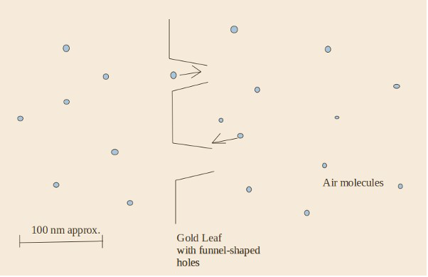
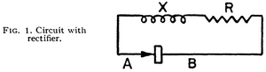

# The Second Law of Thermodynamics

Recently, I had an experience that can be rather unpleasant for anybody with a background in physics: I didn't understand why a "free energy machine" couldn't work, because I didn't completely understand/feel [the second law of thermodynamics](http://en.wikipedia.org/wiki/Second_law_of_thermodynamics). This is particularly annoying, because thermodynamics (TD) in general and the second law in particular is extremely important in physics. Many important physicists (and chemists as well) spent time working on TD and used it as a basis for their research. TD is so useful because it is a rather abstract framework, making it applicable to almost every real-life system. However, we must note that the second law of TD has no theoretical derivation: it is originally an empirical result. A very reasonable empirical result, and indeed also a very elegant empirical result, as it can be used to investigate everything from chemical reaction to black holes and even suggests a relation between entropy and "the arrow of time". This has led many to believe that the second law of TD may in fact be a fundamental property of our universe, again a reasonable belief, because we have never seen violations of it, despite, for example, millions of years of evolution.

So, if we don't understand something about the second law or if we cannot explain why a perpetuum mobile couldn't work, there's always some benefit of getting to the bottom of the situation. If we're lucky, we find situations in which the second law doesn't hold, which is important to know when trying to do physics in those situations and may allow us to understand the second law as an emergent property in large systems. For example, when we are studying one atom in quantummechanics, TD is clearly not the right tool because properties such as temperature are only defined when there's many particles. However, also in the (expected) case that the second law does hold up, we can gain valuable insights: following the second law, one can gain a better understanding of the microscopic processes that prevent a system from delivering the free energy.

Thus, I started digging in literature and finally got a better grip on TD (about time, 6 years after my TD classes). I documented the results here so that other interested people will have an easier time, but also to make sure that I can continue my investigation later, even when I forget all this stuff (which I undoubtedly will). Unfortunately, I still don't understand enough to explain everything, so do expect a lot open ends: it's really quite amazing how quickly following the second law leads you to the edges of what we/you can explain!

## Ratchets

The class of machines that I have been looking at is those of the "ratchets". They're called ratchets, because they're based on breaking symmetry, just like a ratchet does: it's easy to turn the ratchet in one direction, but very hard to turn it in the other direction. The reason such a ratchet can be imagined to generate "free energy" has to do with the so-called "thermal equilibrium". One has to know that temperature is in fact related to the average movement of a large number of particles. As those particles are moving, they can exert a force and transfer energy to stuff that it comes in contact with. For example, when hot water comes into contact with cold metal, part of the energy in the movement of the water molecules will be transferred to the metal, so that the metal heats up and the water cools down. When a system is in thermal equilibrium, however, there is at each point just as much energy leaving that point as there's energy coming in (for "large points", because its only true on average of course). So, in thermal equilibrium1, the transfer of energy is completely symmetric. 

Now, as I mentioned, one can use a ratchet to try to break that symmetry in thermal equilibrium. After all, that symmetry only exists on average; if we look at the level of particles, they are sometimes by chance moving all in the same direction, then some other time, by chance, moving in the other direction again. This effect is known as thermal noise, and is very well described by TD. So, to give the famous example of the [Feynman-Smoluchowski ratchet](http://en.wikipedia.org/wiki/Brownian_ratchet) (invented by Smoluchowski, made famous by Feynman), image a paddle wheel in a chamber of gas, attached with an axle to a ratchet in another chamber. Because of the thermal noise in the gas chamber, the gas continuously exerts small forces on the paddle wheel. Because of the ratchet however, a force exerted in one way will result in the axle turning, while a force exerted the other way will not be able to turn the axle. We broke the symmetry of the thermal noise! Now we can for example put a rope around the axle and use its turning to lift a bucket.

As you probably know, this is not allowed by the second law of TD, because we extract energy from a thermal equilibrium, do some work with it, and then we could simply let the system return to the same thermal equilibrium; thus, we would have made a perpetuum mobile! Nasty, right? Luckily, this paradox has a well-documented solution: there's not only thermal noise in the gas chamber, but also in the ratchet! Thus, the ratchet will fail continuously (note that the forces on the axle are miniscule, so that the ratchet must be very sensitive) and it is impossible to extract work form there. To prove that this is indeed the case is no simple endeavour though! Even Feynman himself apparently made an error in his derivations of this system in '63 that was only corrected in the nineties (see the report by Reimann in the links, section 6.2)! By the way, note that this solution also means that work _can_ be extracted if the ratchet and the gas chamber are _not_ at the same temperature, with the ratchet surprisingly turning the wrong way in one of those two situations!

## An Application: the Derricutt Ratchet

We learned a lot already, so let's try to apply this knowledge to a new ratchet, invented by [Simon Derricutt](http://revolution-green.com/author/simon-derricutt/). I was discussing this ratchet with him, and I could not really tell why I didn't expect it to work. We take a sheet of a very thin material, and make holes in it. However, we are careful that when we make the holes, the edges are bent inward to one side and slightly flexible (see the drawing). Now this foil is put into a gas chamber and the question is what would happen. If the edges of the holes where not flexible, clearly nothing would happen: the trajectories of the particles going from left to right are the same as the reverse, and the same number of particles pass through the holes at all times. But because the edges _are_ supposed to work like a spring (they bend a little when a gas particle hits), there are actually more trajectories from the left to the right than from the right to the left, resulting in a pressure difference and movement of the foil!

Let's see what we get if we make a parallel to the Feynman-Smoluchowski ratchet. Instead of one gas chamber, we now have two, but because we now assume the second law to hold, there is no pressure or temperature difference between those two compartments. Thus, the gases of the two ratchets are comparable. Then, it is also clear that the holes in the foil are analogous to the ratchet: it is the thing that breaks the symmetry in the thermal noise. And that means that TD makes a clear prediction: if the foil is colder than the gas, it will move in the intended direction, if it is warmer than the gas it will move in the other direction, but if the foil is at the same temperature of the gas, it will not move at all. 

Is this a reasonable or understandable prediction? If the foil is at absolute zero, the ratchet will work as expected, so that's allright. But what happens if the temperature of the foil increases? The molecules of the foil will gain kinetic energy and start vibrating; that's what temperature of a solid is in its simplest form. But as the edges of the holes were made flexible intentionally, those edges will start vibrating by themselves as well! In other words, the flexibility of the edges of the foil is a degree of freedom for the system, and this degree of freedom contains an amount of energy that is determined by the temperature. If the temperature of the gas is the same as the temperature of the foil, this degree of freedom contains the same amount of energy as the average kinetic energy that the particles have perpendicular to the foil (not coincidentally: every degree of freedom gets the same amount of energy). So while indeed some particles will pass through the funnel as intended, others will be stopped in their tracks by an edge that is just at that moment bouncing back. If TD is correct, all these probabilities even out precisely if the temperatures of foil and gas are equal. Maybe even more interesting is the final prediction from the second law: if the foil is warmer than the gas, the foil should be propelled in the opposite direction. In a very cold gas, that actually reminds me of swimming, but I don't really see how it could work. Perhaps there is even some concept of friction hidden in this ratchet?

The above is clearly not an answer at all. However, it does give some intuition about the problem at hand, and at least for me it gives a reasonably plausible explanation for the ratchet not providing free energy (even though I cannot see it exactly yet). It also shows precisely how one would go about giving a definitive answer: you would have to make a good model of this system, including the vibrations of the foil, and actually calculate all those probabilities (or create an accurate simulation). Another approach is of course to build the system and test it. For the case in which the temperatures of the foil and the gas is the same, this is indeed possible (but one would have to be careful with sunlight for example). Testing the ratchet with different temperatures of gas and foil may be a bit more difficult, in particular if you want the foil to be colder than the gas. 

## The Rectifier and Potential Energy

The system that I became interested in orginally was the rectifier, as a simplification of a "solar panel" for thermal (black body) radiation: I reckoned that if it would be possible for a solar panel at room temperature to extract electricty from mid-IR radiation, it would basically be a diode rectifying thermal fluctuations. It's not exactly the same, because a photovoltaic material is a good deal more complicated than a diode, but as I couldn't understand why the diode wouldn't generate electricity I found it a good place to start. By the way, note that some people are trying to build rectenna's for mid-IR radiation, which means those guys are _really_ pushing the TD limits if they want to make those work at room temperature, as those things are basically working on the single photon level (so no averaging over time either) 2. 

Back to the rectifier. The rectifier has in fact been proposed a long time ago by Leon Brillouin himself (Brillouin, Léon. "Can the rectifier become a thermodynamical demon?." Physical Review 78.5 (1950): 627. Not available online unfortunately, but you can get the article from me if you're interested). The system is very simple: just attach a resistor to diode (see drawing below). As the electrons in the resistor can move and will contain some of the thermal energy in the system, a small, fluctuating eletric potential difference will be generated between the leads of the resistor. This type of thermal noise is called [Johnson noise](http://en.wikipedia.org/wiki/Johnson%E2%80%93Nyquist_noise) and the voltage increases with the resistance and the temperature. The diode is then breaking the symmetry of the noise, or in electronics words, rectifying the signal. Just like with the Feynman-Smoluchowski ratchet, no current will flow when the temperature of the resistor and the diode are the same; the current will flow in the "normal" direction of the diode if the diode is colder than the resistor, and the current will reverse direction if the diode is warmer than the resistor. This has been verified experimentally by J B Gunn at IBM (from the Gunn diode), see [his first article](http://www.neidenoff.com/mediapool/121/1215532/data/G4-Gunn.pdf), and his second article that includes a plot (Gunn, J. B. (1969). "Spontaneous Reverse Current Due to the Brillouin Emf in a Diode". Applied Physics Letters 14 (2): 54. Obtainable from me again).

So there's potential energy in the system (a tiny amount of electrical energy in this case), but we cannot take it out! When using a simple P-N junction as your diode, this can be understood intuitively reasonably well, when you realize that the P-N junction is also a thermodynamic equilibrium: the charge carriers at the interface are continuously moving about thanks to their thermal energy, recombining, etc. Thus, when looking at this microscopic level, nothing in this equilibrium is actually breaking the symmetry at the energy levels of the thermal equilibrium! Only when applying larger voltages over the diode, the P-N junction will do its work as a rectifier. So, while I don't really have a full understanding yet here either (I think mainly because I don't fully understand the relation between the energy and the voltage of the Johnson noise yet), I can imagine that this system is fundamentally the same as the Feynman-Smoluchowski ratchet.

## Quantum Mechanics?!

Of course, I next took refuge to Quantum Mechanics (QM) as something that is described particularly badly by TD. QM deals with single particles and very small systems, while TD is by design only valid for large systems. Thus, theoretically, one can escape the laws of TD by devising a system that is in fact a magnification of a QM effect to a macroscopic level. Now, I'm quite sure that it won't be so easy practically, maybe even (theoretically?) impossible, but it's at least a tantalizing possibility, right? So, can we construct a diode using a QM effect? Well, indeed, we can, in the early days of electronics devices known as [tunnel diodes](http://en.wikipedia.org/wiki/Tunnel_diode) showed quite some potential thanks to there very high switching frequencies, a "negative resistance" area, and longevity (eg when used in spacecraft). A tunnel diode is similar to a normal diode, but has different doping applied to obtain a reverse breakdown voltage of 0, but a barrier at a small forward bias3. 

When applying this small forward bias, electrons in the conduction band one the one side have the same energy as holes in the valence band on the other side, and the electrons can tunnel through the barrier, as described by QM. When increasing the bias further, the bands are not aligned anymore and the current decreases (the negative resistance region). When increasing the bias even further, the diode starts to conduct like a normal diode. So, these diodes should be able to break symmetry, thanks the QM effects at low bias voltages, avoiding the trap of relying on a TD equilibrium for the rectification. Unfortunately, I cannot yet explain why a ratchet with such a tunnel diode couldn't work. Naturel places to start further research would be to find out whether this system can _really_ not be described as a TD equilibrium, to learn about the temperature dependence of tunneling (as the TD prediction would still be that there is a current when there's a temperature difference), and to find out about non-tunneling effects in eg MIM diodes (to prevent a too narrow search). 

## An Experiment

While I may be unable to explain the system theoretically, we can at least verify the depressing, universal truth of the second law experimentally. So, let's use one of those tunnel diodes instead of a regular diode next to a resistor and see what happens. Unfortunately, tunnel diodes require different manufacturing processes than MOSFETs and they were superceded by other devices, making them very expensive to buy new. Nevertheless, we can still buy old stock relatively cheaply and I already have an old Soviet tunnel diode (GI401A, a backward variant because I thought it would show a bigger asymmetry around 0 bias voltage). I hope to put it to the test soon and replicate the results by Gunn that I referenced earlier. I probably need to either build the circuit at a university to use their measuring equipment or spend some extra time to create a purpose-built circuit; measuring at very low voltages and currents is of course not straightforward. 

After reading some papers (including [this one](http://mems.eng.usf.edu/pub/Papers/Subb-2.pdf) by Krishnan, Stefanakos and Bhansali in Thin Solid Films, 2008), I now have a slightly better understanding of the effects that we would be after. When electrons escape from a material, they also have to end up somewhere. The process can be described mathematically, depending on where the electrons actually end up. Let's consider the simple case of a MIM diode with vacuum as its insulator. If the electron tunnels from one metal directly to the other metal, this is referred to in literature as "direct tunneling". I think this process has to be symmetric with respect to offset voltage (check this sometime!), and is thus of no use for a rectifier and the direct tunneling current should be kept as small as possible (by making the insulater think enough, current falls of exponentially with insulator thickness IIRC). However, in the presence of an electric field, the electron can also end up in the insulater and then make its way further to the other metal. The escape process is called Fowler-Nordheim tunneling ([Relevant wikipedia article](http://en.wikipedia.org/wiki/Field_electron_emission)) and is basically tunneling through a triangular barrier. Thus, the question then becomes whether Fowler-Nordheim tunneling is giving a non-neglible contribution to the current in a MIM diode close to zero bias. Now, that's finally something that can be investigated without too much trouble, even though very sophisticated equipment would be necessary (similar to equipment used for STM and MIM diode fabrication and characterization).

## Would You Like Gravy With Your Ratchet?

Yet another night spent thinking about this stuff, and I came up with a final ratchet. Note that in the rectifier ratchet, we try to extract the potential energy that is part of the thermal energy in the system. I still didn't really find out why that wouldn't be possible, so I thought about other forms of potential energy, such as gravitational energy. Gravity is an interesting thing, and its relation with TD is still a bit mysterious, even though the last couple of years have seen a lot of progress on this area. Let's first imagine a perfect gas, except that we don't neglect gravity. If it's hard to imagine, also assume that gravity is much stronger than it actually is, or that the "perfect gas" is a bunch of bouncing stars in a box. The whole thing is suspended in vacuum, so that we don't have gravitational effects from outside. Basically we're talking about the Giant Molecular Clouds, in which stars are born (which is triggered by external shockwaves and so on, and then proceeds with nuclear fusion; the galaxy is _very_ far away from TD equilibrium). 

So, at first I thought that particles would move faster in the center of the cloud because of the energy they gain from falling to the center. However, what would actually happen is that the number of particles simply increases in the center (higher pressure), but the temperature should be the same everywhere. I'll have to check the mathematics. Anyway, this system may be an interesting way to start thinking about relativistic thermodynamics, as gravity plays an important role in them. These subjects have been discussed a lot in the last century, but are nevertheless still relevant, see for example the recent work on [Entropic Gravity](http://en.wikipedia.org/wiki/Entropic_gravity). 

## Conclusion

Starting from TD we made our way to QM and maybe even gravity. In case the entropy is indeed a governing principle of the universe, it may in fact be possible to derive useful properties of QM and relativity using thought experiments such as those presented above. If entropy is not a governing principle of the universe, on the other hand, we should be able to precisely specify the conditions for the second law of TD to hold (and thus, also how to get around it). Both cases look like very interesting research to me!

## Footnotes

1 There's lots of interesting non-equilibrium TD as well, but we ignore it here. For our purpose, that is reasonable, because all systems tend to thermal equilibrium and usually reach it rather quickly (order of hours). An exception would for example be a chemical battery that keeps working for a couple of years, but we're not interested in batteries now.

2 As a further interesting aside, a material covered with nantenna's tuned to the mid-IR would give an opportunity to an excellent TD-compliant "free energy" machine: a heat engine between outer space and the surface of the earth. The atmosphere is namely completely transparent to a range of mid-IR frequencies, known as the "atmospheric window". Thus, such the nantenna material would radiate its heat energy away through the atmosphere, but receive almost no radiation back at those frequencies (space is quite cold). Thus, this stuff would cool down quite a bit, even in the middle of the day! Thus, you'll have an outer-space cooled fridge, that can generate electricty from the temperature difference to boot :-) Of course, this all will only be possible if we are able to make a material that is not only strongly coupling to those mid-IR frequencies but also reflecting most other frequencies. [Here's a good article in PNAS by Byrnes et al (2014)](http://www.pnas.org/content/111/11/3927.full.pdf). 

3 A newer variant of a tunnel diode is the Metal-Insulator-Metal diode, which is currently an active research area. In this variant, the barrier is made by an insulator and two metals with different work functions are selected. Thanks to the different Fermi energies, the barrier is smaller one way than it is the other way. Ideally I would use such a diode for my experiment, but they are not so easy to make.

## Links

* [John E.J. Schmitz](https://secondlawoflife.wordpress.com/) Blog by a chemist that wrote a book about the second law of TD.
* [Peter Reimann: Brownian motors: noisy transport far from equilibrium, 2001](http://arxiv.org/pdf/cond-mat/0010237.pdf) Must-read report reviewing all essential work on ratchets.
* [Hmolpedia: Encyclopedia of Human Thermodynamics, Human Chemistry, and Human Physics](http://www.eoht.info/) Ok, only tangentially relevant, but such a nice website that I had to include a link somewhere ;-)
* [Geller Labs](http://www.gellerlabs.com/JCan%20Parts%20and%20Kits.htm) DIY circuit for measuring Johnson noise.
* []
